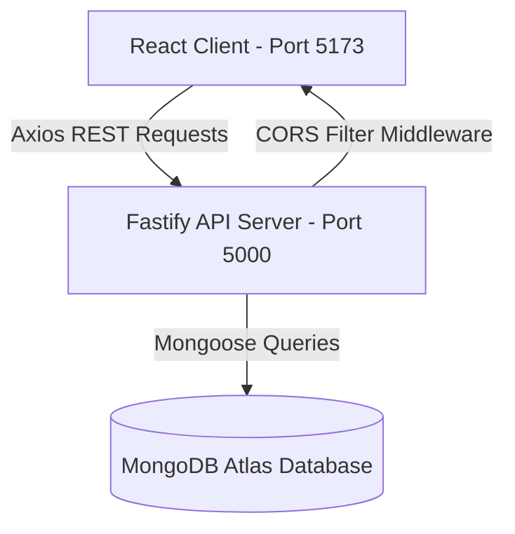

# FeedbackHub - Technical System Documentation

This document describes the technical architecture, database schema configurations, REST API contracts, UI styles, and common questions for the **FeedbackHub** Event Feedback Management System with Role-Based Access Control (RBAC).

---

## 1. System Architecture

FeedbackHub is built as a modular client-server application implementing Role-Based Access Control (RBAC):



- **Frontend (Client)**: A Single Page Application (SPA) built with Vite and React. It uses Tailwind CSS for visual design, React Router for client-side routing, and React Hot Toast for micro-animations and status updates.
- **Backend (Server)**: A Fastify server using asynchronous route handler plugins. It utilizes `@fastify/jwt` for signing and verifying tokens, and `@fastify/cors` to secure access.
- **Database (Persistence)**: MongoDB cloud cluster with three schema-enforced collections: `users`, `events`, and `feedbacks`.

---

## 2. Schema Design (Mongoose)

### 1. User Schema (`User.js`)
Stores authenticated user credentials and roles.
```javascript
const userSchema = new mongoose.Schema({
  name: { type: String, required: true, trim: true },
  email: { type: String, required: true, unique: true, lowercase: true, trim: true },
  password: { type: String, required: true },
  role: { type: String, enum: ['admin', 'user'], default: 'user' },
  createdAt: { type: Date, default: Date.now },
});
```

### 2. Event Schema (`Event.js`)
Stores global events managed by Administrators.
```javascript
const eventSchema = new mongoose.Schema({
  title: { type: String, required: true, trim: true },
  category: { type: String, required: true, trim: true },
  description: { type: String, required: true },
  venue: { type: String, required: true },
  date: { type: Date, required: true },
  image: { type: String, required: true },
  createdAt: { type: Date, default: Date.now },
});
```

### 3. Feedback Schema (`Feedback.js`)
Stores attendee feedback responses. Enforces a compound unique index so a user can review an event at most once.
```javascript
const feedbackSchema = new mongoose.Schema({
  eventId: { type: mongoose.Schema.Types.ObjectId, ref: 'Event', required: true },
  userId: { type: mongoose.Schema.Types.ObjectId, ref: 'User', required: true },
  rating: { type: Number, required: true, min: 1, max: 5 },
  message: { type: String, required: true },
  createdAt: { type: Date, default: Date.now },
});

feedbackSchema.index({ eventId: 1, userId: 1 }, { unique: true });
```

---

## 3. REST API Specifications

### 1. Authentication Endpoints

#### `POST /api/auth/register`
- **Description**: Registers a new user. If the email domain ends in `@admin.com`, the user automatically gets the `admin` role; otherwise, they default to `user`.
- **Request Body**:
  ```json
  {
    "name": "Jane Doe",
    "email": "jane@admin.com",
    "password": "SecurePassword123!"
  }
  ```
- **Response (`201 Created`)**:
  ```json
  {
    "success": true,
    "message": "User registered successfully"
  }
  ```

#### `POST /api/auth/login`
- **Description**: Authenticates user and returns a signed JWT containing their identity and role.
- **Request Body**:
  ```json
  {
    "email": "jane@admin.com",
    "password": "SecurePassword123!"
  }
  ```
- **Response (`200 OK`)**:
  ```json
  {
    "token": "eyJhbGciOiJIUzI1NiIsInR5cCI6IkpXVCJ9...",
    "user": {
      "id": "6a2fe9d6d5cfd7bb821d0659",
      "name": "Jane Doe",
      "email": "jane@admin.com",
      "role": "admin"
    }
  }
  ```

#### `GET /api/auth/promote`
- **Description**: Easiest developer/QA endpoint to instantly promote any existing user to an Admin role without using database commands.
- **Query Parameters**:
  - `email`: The email of the registered user to promote.
  - `code`: The secret validation passcode (value: `admin123`).
- **Example Request**:
  `GET http://127.0.0.1:5000/api/auth/promote?email=user@example.com&code=admin123`
- **Response (`200 OK`)**:
  ```json
  {
    "success": true,
    "message": "User user@example.com has been promoted to Admin successfully!"
  }
  ```

---

### 2. Event Endpoints

#### `GET /api/events`
- **Description**: Public route to get all events with computed average ratings and review counts.

#### `GET /api/events/:id`
- **Description**: Returns detailed event info. If authenticated as Admin, retrieves all feedbacks for this event; if standard user, retrieves only their own feedback.

#### `POST /api/events` (Admin Only)
- **Description**: Creates a new event.

#### `PUT /api/events/:id` (Admin Only)
- **Description**: Updates event properties.

#### `DELETE /api/events/:id` (Admin Only)
- **Description**: Deletes an event. **Triggers cascading deletion** to automatically remove all associated feedback entries in the `feedbacks` collection.

---

### 3. Feedback Endpoints

#### `POST /api/feedback` (User Only)
- **Description**: Submits feedback for an event. Validates rating (1-5), message length, and compound unique restriction.

#### `PUT /api/feedback/:id` (User Only)
- **Description**: Allows a user to edit their own submitted feedback.

#### `DELETE /api/feedback/:id` (User Only)
- **Description**: Allows a user to delete their own submitted feedback.

#### `GET /api/feedback/my` (User Only)
- **Description**: Returns all feedback submissions authored by the current logged-in user.

#### `GET /api/admin/feedback` (Admin Only)
- **Description**: Streams a searchable, filterable list of all feedback submissions platform-wide.

---

### 4. Dashboard Endpoints

#### `GET /api/admin/dashboard` (Admin Only)
- **Description**: Returns global statistics (total events, total users, total feedbacks, system rating average, top-rated event, and most active event).

---

## 4. Spacing, Typography & Style Guide

- **Theme**: Premium dark mode theme built on `bg-slate-950` backdrops and `text-slate-100` contrasts.
- **Fonts**:
  - Headers: **Outfit** (modern, geometric tracking).
  - Body: **Plus Jakarta Sans** (highly legible clean typeface).
- **Interactive Colors**: Gradients blending `violet-400` via `fuchsia-400` to `indigo-400` highlight core headers. Interactive elements focus on `violet-600` primary buttons.
- **Card Styling**: Glassmorphic panels built with `bg-slate-900/40` and translucent borders `border-slate-800` that transition to `border-violet-500/30` on hover.

---

## 5. QA Interview Questions & Answers

### Q1: How does cascading delete work when an event is deleted?
**Answer**: In `eventController.js`'s `deleteEvent` function, when an admin deletes an event, we perform two database operations: first, we delete the event document via `Event.deleteOne({ _id: id })`; second, we delete all associated feedback comments using `Feedback.deleteMany({ eventId: id })`. This ensures we do not leave orphaned reviews in our database.

### Q2: What is the benefit of using JWT roles for authentication?
**Answer**: By encoding the user's role (`role: 'admin' | 'user'`) inside the signed JWT payload, the client and server can verify the user's authorization claims statelessly. The server extracts the role from the decrypted token inside the `verifyAdmin` middleware to guard admin routes, while the client extracts the role to configure conditional navigation paths and component access.

### Q3: How is duplicate feedback submission prevented?
**Answer**: We implement a compound unique index on the Feedback schema: `feedbackSchema.index({ eventId: 1, userId: 1 }, { unique: true })`. If a user attempts to submit feedback for the same event a second time, MongoDB blocks the insertion and returns a duplicate key error, which the controller handles to return a friendly validation message.
