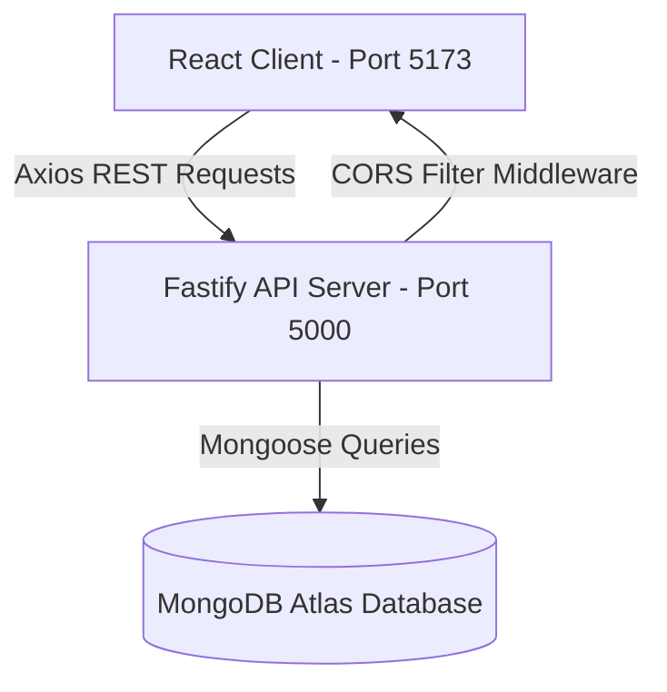

# FeedbackHub - Technical System Documentation

This document describes the technical architecture, data model configurations, REST API contracts, UI styles, and common interview questions for the **FeedbackHub** Event Feedback Management System.

---

## 1. System Architecture

FeedbackHub is built as a modular client-server application:



- **Frontend (Client)**: A Single Page Application (SPA) compiled by Vite. Utilizes Tailwind CSS utility styles and React Router for Client-Side Routing.
- **Backend (Server)**: A Fastify server using asynchronous route handler plugins. Focuses on low overhead and high throughput.
- **Database (Persistence)**: MongoDB cloud cluster managing a single, schema-enforced `feedbacks` collection.

---

## 2. Schema Design (Mongoose)

MongoDB documents are saved in the `feedbacks` collection under this structural model:

```javascript
const feedbackSchema = new mongoose.Schema({
  name: {
    type: String,
    required: true,
  },
  email: {
    type: String,
    required: true,
  },
  eventName: {
    type: String,
    required: true,
  },
  message: {
    type: String,
    required: true,
  },
  createdAt: {
    type: Date,
    default: Date.now,
  },
});
```

---

## 3. REST API Specifications

### 1. `GET /api/welcome`
- **Description**: Landing greeting and API connectivity validation check.
- **Response**: `200 OK`
  ```json
  {
    "message": "Welcome to Event Feedback Management System"
  }
  ```

### 2. `POST /api/feedback`
- **Description**: Inserts a new feedback document in MongoDB.
- **Payload Request Headers**: `Content-Type: application/json`
- **Payload Request Body**:
  ```json
  {
    "name": "Jane Doe",
    "email": "jane@example.com",
    "eventName": "Global Design Conference",
    "message": "Loved the UI workshop, very insightful and helpful!"
  }
  ```
- **Response**: `201 Created`
  ```json
  {
    "name": "Jane Doe",
    "email": "jane@example.com",
    "eventName": "Global Design Conference",
    "message": "Loved the UI workshop, very insightful and helpful!",
    "_id": "6a2fe9d6d5cfd7bb821d0659",
    "createdAt": "2026-06-15T12:02:30.436Z",
    "__v": 0
  }
  ```

### 3. `GET /api/feedback`
- **Description**: Retrieves a chronological list of all saved feedback.
- **Response**: `200 OK`
  ```json
  [
    {
      "_id": "6a2fe9d6d5cfd7bb821d0659",
      "name": "Jane Doe",
      "email": "jane@example.com",
      "eventName": "Global Design Conference",
      "message": "Loved the UI workshop, very insightful and helpful!",
      "createdAt": "2026-06-15T12:02:30.436Z",
      "__v": 0
    }
  ]
  ```

---

## 4. Spacing, Typography & Style Guide

- **Theme**: Premium dark mode theme built on `bg-slate-950` backdrops and `text-slate-100` contrasts.
- **Fonts**:
  - Headers: **Outfit** (modern, geometric tracking).
  - Body: **Plus Jakarta Sans** (highly legible clean typeface).
- **Interactive Colors**: Gradients blending `violet-400` via `fuchsia-400` to `indigo-400` highlight core headers. Interactive elements focus on `violet-600` primary buttons.
- **Card Styling**: Glassmorphic panels built with `bg-slate-900/40` and translucent borders `border-slate-800` that transition to `border-violet-500/30` on hover.

---

## 5. QA Interview Questions & Answers

### Q1: Why choose Fastify over Express for a Node.js backend?
**Answer**: Fastify has significantly lower overhead and is up to 2-3 times faster than Express in routing and serialization benchmarks. It features native support for JSON schema validations, built-in asynchronous hook lifecycle handlers, and structural logger bindings using Pino. This reduces dependency overhead and results in higher performance.

### Q2: What is CORS and how does it secure our Fastify server?
**Answer**: Cross-Origin Resource Sharing (CORS) is a browser-enforced security mechanism that prevents web pages from making requests to a different domain than the one that served the page, unless the server explicitly permits it. In our Fastify backend, the `@fastify/cors` plugin configures our server to whitelist only our React frontend origin (`http://localhost:5173`) for POST, GET, and OPTIONS requests, blocking unauthorized third-party cross-origin requests.

### Q3: Why do we use Mongoose schemas when MongoDB is schema-less?
**Answer**: While MongoDB is naturally dynamic and schema-less at the database level, production applications require strict data integrity. Mongoose enforces document validation, sets field requirements (e.g., `required: true`), establishes default fallback values (e.g., `Date.now` for timestamps), and sanitizes payloads at the application level before data is written to the database.

### Q4: How does the dynamic Event-to-Feedback routing work?
**Answer**: When a user clicks **Share Feedback** on an `EventCard`, we use React Router's `useNavigate` hook to append the event's name as a search parameter in the URL (e.g. `/feedback?event=Tech%2520Innovators%2520Summit`). On the `Feedback` page, we parse this query parameter using the `useSearchParams` hook and use a `useEffect` hook to set the form's `eventName` input state, automatically pre-selecting the correct event in the dropdown.

### Q5: How do skeleton loaders improve User Experience (UX)?
**Answer**: Plain text loading labels or empty pages create high cognitive loading and make the application feel slow or broken. Skeletons simulate the card outlines and page layout while data is being fetched. This reduces the perceived waiting time and provides a smooth transition when the database query returns.
